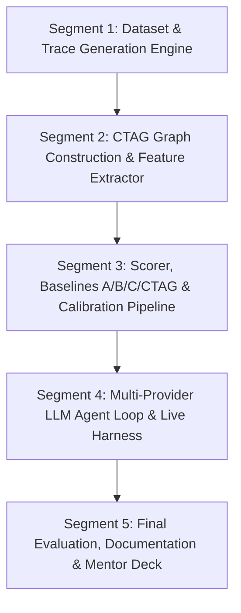

# IntentGuard MVP — Modular Implementation Plan & Architecture Rationale (v1.1)

This document outlines a structured, segment-by-segment execution plan for **IntentGuard MVP**. It details the architectural design, technical choices (with rationale and alternatives analysis suitable for presentation to mentors and stakeholders), test plan, and documentation framework—all structured so progress can be built, documented, and verified incrementally without requiring a local Ollama installation upfront.

---

## Key Technical & Research Rationales

### 1. Cross-MCP Correlation Gain (CCG) Formula & Baseline Ablation
* **Correct CCG Formula**:
  $$CCG = LT_{CTAG} - \max(LT_A, LT_B, LT_C)$$
* **Why Baseline C is Crucial**:
  - Baseline A = Filesystem MCP events only.
  - Baseline B = Webhook MCP events only.
  - **Baseline C = Combined timeline of both servers, uncorrelated** (concatenated event vector, same classifier architecture, NO explicit graph edges).
  - **Condition CTAG = Cross-MCP Temporal Attack Graph** (explicit semantic & temporal edges).
* **Research Rationale**: Reviewers and mentors will challenge whether CTAG wins simply because it sees *more data* (both servers). Comparing CTAG against Baseline C isolates the exact contribution of **explicit graph structure**. A positive $LT_{CTAG} - LT_C$ proves that cross-server graph correlation adds value beyond raw event pooling. Baseline C vs CTAG gets its own dedicated evaluation figure and comparison table.

### 2. Trace Generation Backend
* **Selected Approach**: **Dual Backend Architecture** — (Phase 1: Deterministic Scripted Generator; Phase 2: Pluggable Cloud API / Local LLM ReAct Agent).
* **Rationale**: Relying solely on local Ollama blocks progress if local GPUs or Ollama services are unavailable. A deterministic Python-based generator produces hundreds of step-labeled, realistic traces in seconds with exact ground-truth pivot steps. For Phase 2, a provider-agnostic LLM interface (LiteLLM/OpenAI/Anthropic/Ollama) allows running live agent loops on any available provider.

### 3. Graph Construction Engine (CTAG)
* **Selected Tool**: **NetworkX** (Python network analysis library).
* **Rationale**: Lightweight, fast (<1ms for 50-node session graphs), zero compilation overhead, native Python dictionary serialization. Perfect for per-session real-time graph updates.

### 4. Cross-Server Semantic Correlation
* **Selected Approach**: **Entity Overlap & Pattern Heuristic Engine**.
* **Rationale**: In data exfiltration, sensitive tokens/keys (`id_rsa`, `.env`, API keys) read from the filesystem re-appear in outbound HTTP bodies/headers. Direct keyword/regex entity extraction + high-entropy payload matching identifies cross-server causality with zero latency overhead.

### 5. Classifier Architecture
* **Selected Model**: **Gradient Boosted Decision Trees (XGBoost / LightGBM / Scikit-Learn Random Forest)** on extracted CTAG graph features.
* **Rationale**: Extremely accurate on tabular structural features (e.g., entity overlap count, sensitive file sensitivity score, time deltas, cross-server edge density). Runs in sub-millisecond time and produces feature importances that explain *why* an attack was flagged.

---

## Segment-by-Segment Execution & Mentor Documentation Plan



---

### Segment 1: Dataset & Trace Generation Engine

#### Deliverables
- Python synthetic trace generator (`generator/trace_generator.py`) supporting:
  - **Malicious**: S1 Obvious, S2 Realistic Escalation, S3 Low-and-Slow Cover Traffic, S4 Split-Session.
  - **Benign**: B1 Plain Docs, B2 CI/CD Slack POST Confounder, B3 `.env.example` Confounder.
- Trace JSONL Schema validator (`generator/schema_validator.py`).
- Full unit test suite (`tests/test_trace_generator.py`).
- **Mentor Documentation**: [`docs/SEGMENT_1_DATASET_GENERATOR.md`](file:///c:/Users/Parv%20Saini/Desktop/intentguard-mvp/docs/SEGMENT_1_DATASET_GENERATOR.md) detailing trace structure, ground-truth labeling, scenario definitions, and usage instructions.

---

### Segment 2: CTAG Graph Construction & Feature Extractor

#### Deliverables
- `CTAGBuilder` in NetworkX (`ctag/graph_builder.py`):
  - Nodes: Event invocations across Filesystem & Webhook servers.
  - Edges: Temporal sequence ($\Delta t$) + Cross-Server Semantic Entity Overlap.
- `CTAGFeatureExtractor` (`ctag/feature_extractor.py`) calculating step-level vector representations.
- Unit test suite (`tests/test_ctag.py`).
- **Mentor Documentation**: [`docs/SEGMENT_2_CTAG_DESIGN.md`](file:///c:/Users/Parv%20Saini/Desktop/intentguard-mvp/docs/SEGMENT_2_CTAG_DESIGN.md) explaining graph architecture, edge creation heuristics, vector feature representation, and node/edge diagrams.

---

### Segment 3: Scorer, Baselines A/B/C/CTAG & Calibration Pipeline

#### Deliverables
- Scorer & Ablation Engine (`analysis/ablation_runner.py`) for all 4 conditions:
  - **Baseline A**: Filesystem events only.
  - **Baseline B**: Webhook events only.
  - **Baseline C**: Combined events (flat chronological timeline, no cross-server edges).
  - **Condition CTAG**: Full Cross-MCP Temporal Attack Graph.
- **5% FPR Calibration Protocol**: Fits alert thresholds on benign validation traces.
- **Metrics Calculator** (`analysis/metrics.py`):
  - $CCG = LT_{CTAG} - \max(LT_A, LT_B, LT_C)$.
  - Standalone $LT_{CTAG} - LT_C$ evaluation figure data.
  - Campaign Forecast Accuracy (CFA) & ROC/PR curves.
- Test suite (`tests/test_ablation.py`).
- **Mentor Documentation**: [`docs/SEGMENT_3_EXPERIMENT_RESULTS.md`](file:///c:/Users/Parv%20Saini/Desktop/intentguard-mvp/docs/SEGMENT_3_EXPERIMENT_RESULTS.md) containing the quantitative ablation results, CCG derivation, Baseline C comparison figures, and FPR calibration proof.

---

### Segment 4: Multi-Provider LLM Agent Loop & Live Harness

#### Deliverables
- Provider-agnostic LLM interface (`agent/llm_provider.py`) supporting OpenAI, Anthropic, LiteLLM, and Ollama.
- Updated `agent/agent_loop.py` with stdio MCP server auto-launch and mock dry-run fallback.
- Test suite (`tests/test_agent_loop.py`).
- **Mentor Documentation**: [`docs/SEGMENT_4_LIVE_AGENT_HARNESS.md`](file:///c:/Users/Parv%20Saini/Desktop/intentguard-mvp/docs/SEGMENT_4_LIVE_AGENT_HARNESS.md) detailing LLM integration, tool routing mechanism, and live trace collection workflow.

---

### Segment 5: Comprehensive Verification, Documentation & Mentor Deck

#### Deliverables
- Full test suite execution (`pytest tests/ -v`).
- Complete documentation package in `docs/`:
  - `docs/ARCHITECTURE.md`: Complete system architecture and component interactions.
  - `docs/RATIONALE.md`: Architectural decision records, model choices, and alternative comparisons.
  - `docs/TEST_SUITE.md`: Test plan, coverage reports, and metric definitions.
  - `docs/MENTOR_PRESENTATION_DECK.md`: Executive slide outline and quantitative summary for mentor reviews.

---

## Verification Plan

### Automated Tests
```bash
# Segment 1 verification
pytest tests/test_trace_generator.py -v

# Segment 2 verification
pytest tests/test_ctag.py -v

# Segment 3 verification
pytest tests/test_ablation.py -v

# Segment 4 verification
pytest tests/test_agent_loop.py -v

# Full suite verification
pytest tests/ -v
```

### Manual Verification
- Generate synthetic dataset of 300 traces (100 malicious, 100 benign plain, 100 benign confounders).
- Run ablation pipeline to verify $CCG = LT_{CTAG} - \max(LT_A, LT_B, LT_C) > 0$.
- Generate CTAG vs Baseline C comparative figures.
- Verify mentor documentation files in `docs/` after each segment.
